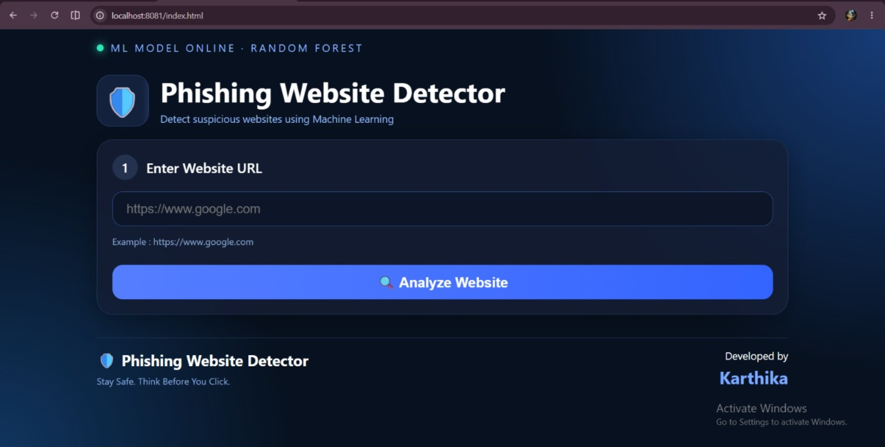
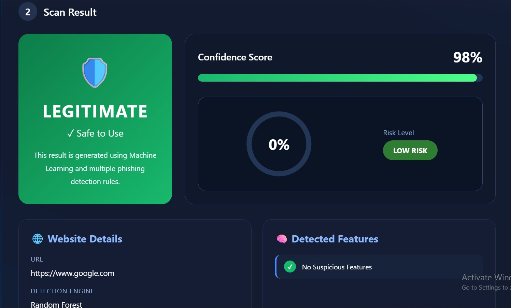
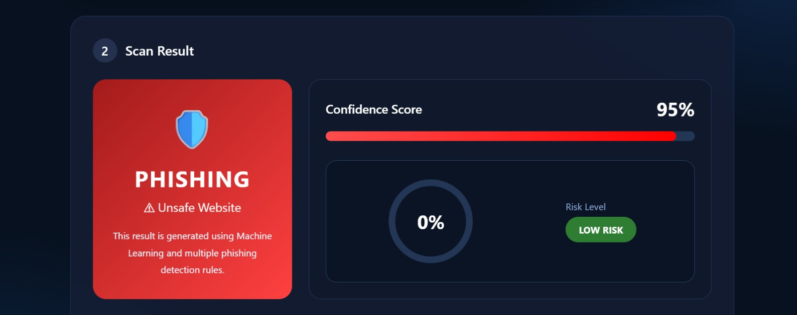
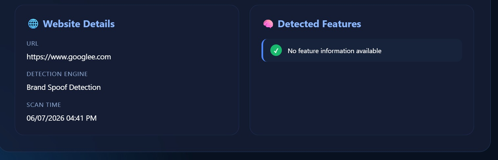
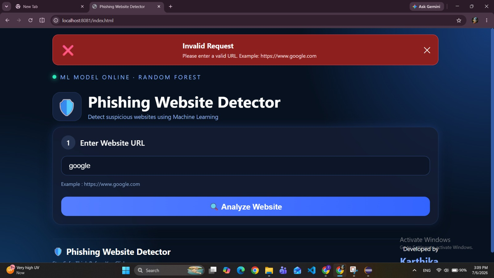
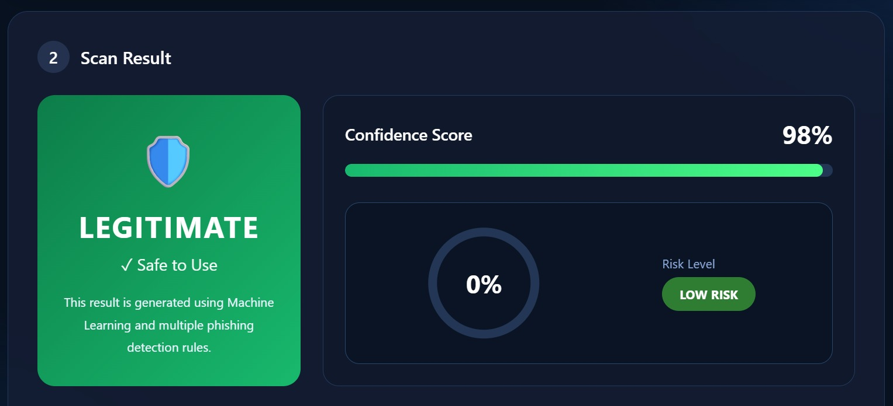
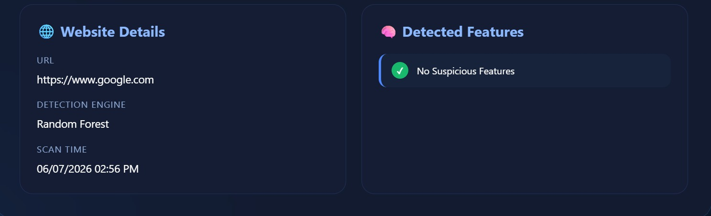

# 🛡️ Phishing Website Detector

#Project Overview

A full-stack web application that detects phishing websites using Machine Learning, URL feature analysis, DNS validation, brand spoof detection, and a custom risk scoring engine.

Developed using Java Spring Boot, Weka Machine Learning, HTML, CSS, and JavaScript.

---
## 🎯 Project Objective

The main objective of this project is to help users identify potentially malicious websites before accessing them.

By combining Machine Learning with rule-based feature analysis, the application improves phishing detection and provides users with an easy-to-understand security assessment.

---

## ✨ Features

- Detects phishing websites using a trained Random Forest model.
- Performs URL validation before prediction.
- Identifies suspicious patterns such as brand spoofing, IP-based URLs, redirects, and shortened URLs.
- Calculates a confidence score and overall risk level.
- Displays detected phishing indicators in a clean dashboard.
- Provides user-friendly error messages for invalid or unreachable websites.
- Responsive and modern user interface built with HTML, CSS, and JavaScript.

---

## 🧠 URL Features Extracted

- IP Address Detection
- URL Length
- URL Depth
- HTTPS Usage
- @ Symbol Detection
- Redirect Detection
- TinyURL Detection
- Hyphen in Domain
- DNS Validation
- Suspicious Keywords
- Brand Spoof Detection

---

## 🛠️ Technologies Used

Backend
- Java 17
- Spring Boot
- Maven

Machine Learning
- Weka
- Random Forest

Frontend
- HTML5
- CSS3
- JavaScript

Tools
- Eclipse IDE
- Git
- GitHub

---

## 📁 Project Structure

See the Project Structure section below.

phishing-detector/
│
├── src/
│   ├── main/
│   │   ├── java/
│   │   │   └── com/phishingdetector/
│   │   │        ├── controller/
│   │   │        ├── service/
│   │   │        ├── model/
│   │   │        ├── util/
│   │   │        ├── config/
│   │   │        └── training/
│   │   │
│   │   └── resources/
│   │        ├── static/
│   │        ├── model/
│   │        └── application.properties
│
├── dataset/
├── screenshots/
├── README.md
├── pom.xml
└── target/

---

## ⚙️ Installation

### Clone the repository

```bash
git clone <repository-url>
```

### Open the project

Import the project into Eclipse as a Maven Project.

### Install Dependencies

Maven automatically downloads the required dependencies.

### Run the Application

Run

```
PhishingDetectorApplication.java
```

The application starts at

```
http://localhost:8081
```

Open the browser and start testing URLs.
---


## 📡 API Documentation

### POST /api/predict

Predicts whether a website is Legitimate or Phishing.

### Request

```json
{
  "url": "https://www.google.com"
}
```

### Successful Response

```json
{
  "prediction": "LEGITIMATE",
  "confidence": 98,
  "riskScore": 0,
  "modelUsed": "Random Forest"
}
```

### Error Response

```json
{
  "status": "INVALID_URL",
  "message": "Please enter a valid URL."
}
```
---

## 📸 Project Screenshots

### 🏠 Home Page

The application home page where the user enters a website URL for analysis.



---

### ✅ Legitimate Website Detection

Example of a trusted website detected as legitimate.



---

### 🚨 Phishing Website Detection (Example 1)

Example showing a phishing website detected by the application.



---

### 🚨 Phishing Website Detection (Example 2)

Another phishing detection example.



---

### ❌ Invalid URL Validation

The application validates incorrect or unreachable URLs before prediction.



---

### 📊 Detection Dashboard (Top)

Dashboard showing prediction, confidence score and risk meter.



---

### 📊 Detection Dashboard (Bottom)

Dashboard displaying website details and detected phishing features.



---

## ⭐ Future Enhancements

- WHOIS Lookup
- SSL Certificate Analysis
- HTML Content Analysis
- Blacklist APIs
- Real-time Threat Intelligence
- Deep Learning Models
- Browser Extension
---

## 👨‍💻 Developed By

**Karthika Thogaru**

BCA Graduate | Aspiring Software Developer

Interested in Java, Spring Boot, Machine Learning and Full Stack Development.

LinkedIn: linkedin.com/in/karthika-thogaru-503654301 

GitHub: github.com/Karthika-pro 
---


